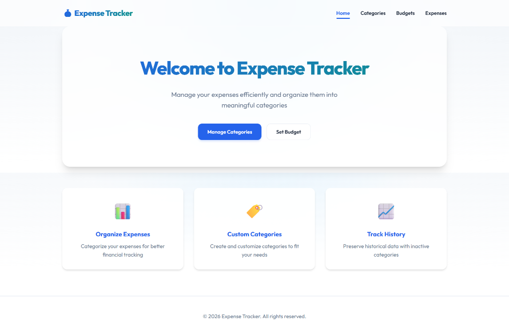
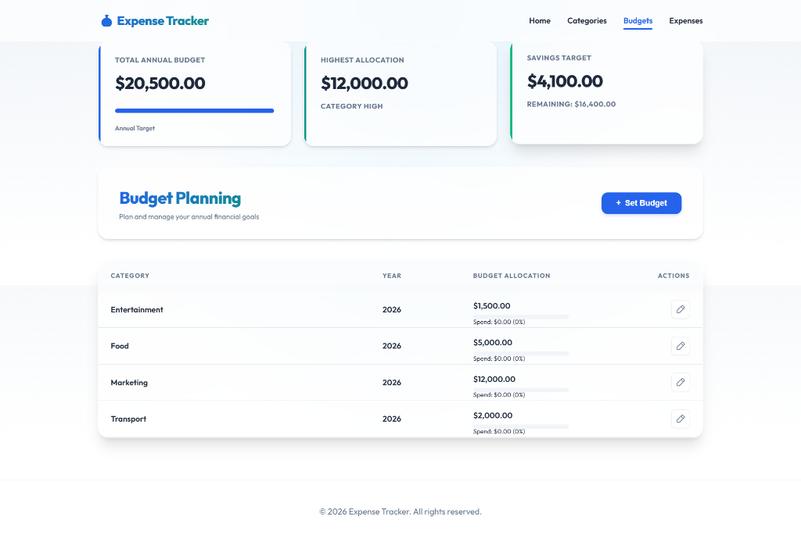
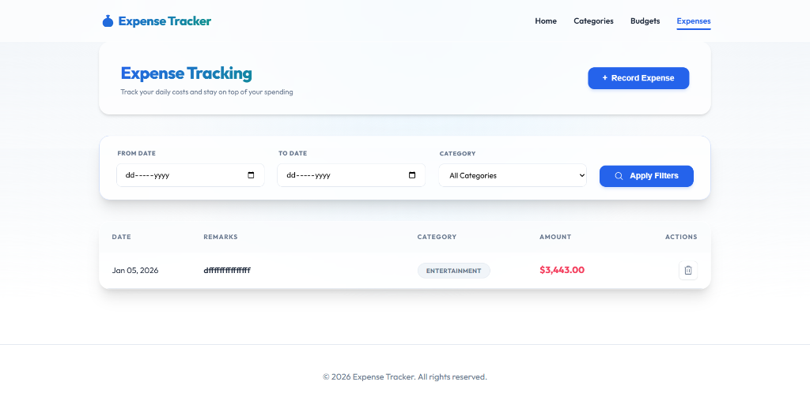
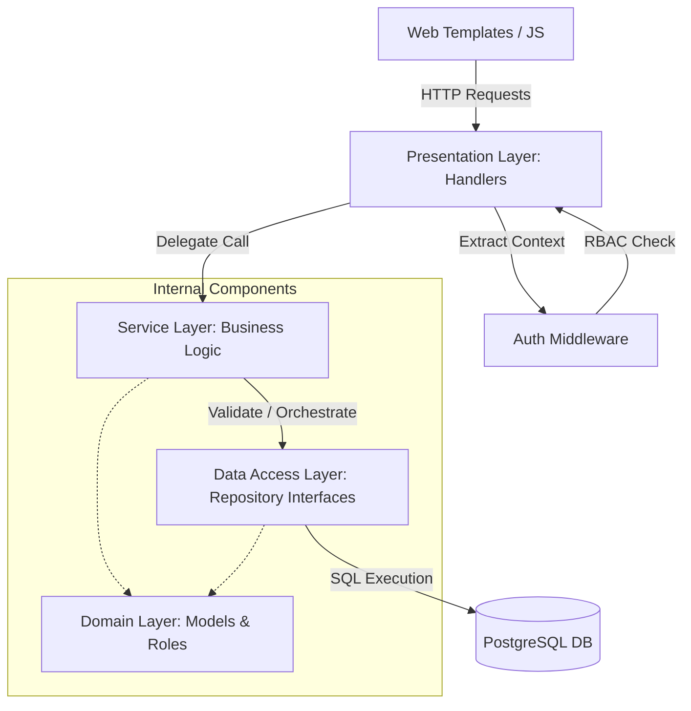

# Premium Expense Tracker

A professional, full-stack financial management application built with **Go**, **PostgreSQL**, and **Docker**. This project features a modern, high-end UI with real-time data management for categories, budgets, and transactions.

## UI Previews

### Dashboard & Home


### Expense Categories


### Budget Planning


### Transaction Tracking


## Project Structure

```
expense-tracker/
├── cmd/
│   └── server/
│       └── serve.go              # Core server setup: dependency injection, router config, and RBAC middleware
├── internal/
│   ├── handlers/                 # Presentation Layer: Maps HTTP requests to service logic
│   │   ├── auth_handler.go       # Login, Logout, and Password management
│   │   ├── auth_middleware.go    # RBAC enforcement and Session validation
│   │   ├── user_handler.go       # Administrative user management
│   │   ├── budget_handler.go     # API for budget CRUD and dashboard summaries
│   │   ├── category_handler.go   # API for category management
│   │   ├── expense_handler.go    # API for transaction management with user context
│   │   └── template_handler.go   # Server-Side Rendering: Prepares data for HTML templates
│   ├── models/                   # Domain Layer: Plain Go objects and business rules
│   │   ├── user.go               # User roles (Admin, Management, Executive) and permissions
│   │   ├── budget.go             # Financial planning structures
│   │   ├── category.go           # Expense classification structures
│   │   └── expense.go            # Financial record structures with user ownership
│   ├── repository/               # Data Access Layer: Isolated SQL logic via interfaces
│   │   ├── interfaces.go         # DECOUPLED repository contracts
│   │   ├── user_repository.go     # User-specific PostgreSQL implementation
│   │   ├── budget_repository.go   # Budget-specific PostgreSQL implementation
│   │   ├── category_repository.go # Category-specific PostgreSQL implementation
│   │   └── expense_repository.go # Expense-specific PostgreSQL implementation
│   └── service/                  # Service Layer: Business Logic & Orchestration
│       ├── auth_service.go       # Authentication & Hashing (bcrypt)
│       ├── user_service.go       # User lifecycle & onboarding flows
│       ├── expense_service.go    # Role-based filtering & budget validation
│       └── category_service.go   # Category initialization & management
├── migrations/                   # Database Evolution: Automatic SQL migrations
│   ├── 001_create_categories_table.sql
│   ├── 002_create_budgets_table.sql
│   ├── 003_create_expenses_table.sql
│   ├── 004_seed_data.sql        # Pre-fills the app with sample data for immediate demo
│   └── 007_create_users_table.sql # IAM schema and default Admin seed
├── web/
│   ├── static/                   # Public Assets: Client-side logic and styling
│   │   ├── css/style.css        # Modern design system (Glassmorphism, Azure theme, Pill badges)
│   │   └── js/
│   │       ├── budgets.js       # AJAX logic for real-time budget updates and dashboard stats
│   │       ├── categories.js    # Logic for dynamic status toggling and local row filtering
│   │       └── expenses.js      # Transaction management and asynchronous list filtering
│   └── templates/                # Modular HTML5 templates
│       ├── login.html           # Authentication entry point
│       ├── set-password.html    # Secure onboarding page
│       ├── index.html           # Landing page with feature overview
│       ├── budgets.html         # Interactive budget planning dashboard
│       ├── categories.html      # Category management interface with status toggles
│       └── expenses.html        # Transaction ledger with search and filters
├── docker-compose.yml            # Container Orchestration: Links Go app, PostgreSQL, and pgAdmin
├── Dockerfile                    # Multi-stage build for a lightweight, secure production image
├── .dockerignore                 # Excludes local files from Docker context to optimize builds
├── .env                          # Local configuration for database secrets and server ports
├── main.go                       # Minimal entry point that boots the cmd/server package
└── README.md                     # Project documentation and developer guide
```

## 🏗️ Full Application Architecture

This project follows a **Layered Architecture** with strict **Dependency Inversion**, ensuring high maintainability and testability.



### Layer Breakdown
- **Presentation Layer**: Handlers parse requests and handle responses. The `AuthMiddleware` intercepts these to inject authenticated user context and verify roles.
- **Service Layer (The Brain)**: Encapsulates all business rules. For example, the `ExpenseService` automatically filters data so Executives only see their own records.
- **Data Access Layer**: Uses the Repository Pattern with interfaces. This hides the "how" of data storage (PostgreSQL) from the "what" of business logic.
- **Domain Layer**: Contains the core entities and role-based permission logic (e.g., `User.CanManage()`).

### Security & IAM Flow
1. **Authentication**: Uses `bcrypt` for secure hashing and in-memory session token management.
2. **Authorization**: Granular RBAC supporting `Admin`, `Management`, and `Executive` roles.
3. **Onboarding**: Automated token-based flow for initial password setup via email (mocked).

## Features

### Comprehensive Management
- **Category Control**: Create, update, and toggle active status for expense groups. Includes local filtering for active-only views.
- **Budget Intelligence**: Set annual targets per category with live dashboard summaries (Total Budget, Highest Allocation, Savings Target).
- **Transaction Ledger**: record daily expenses with remarks and dynamic filtering (date range, category).

### Technical Excellence
- **Dockerized Architecture**: One-command deployment with Go, PostgreSQL, and pgAdmin.
- **Automated Schema**: Intelligent migrations that run on startup to prepare your database.
- **Transactional Integrity**: Robust repository layer with parameterized queries to prevent SQL injection.
- **Premium UX**: Modern Glassmorphism UI, semantic HTML5, and responsive Vanilla CSS.

## Installation

The application is designed to be up and running in seconds.

### Quick Start (Docker)

1. **Clone & Enter**
   ```bash
   git clone <repository-url>
   cd expense-tracker
   ```

2. **Launch Services**
   ```bash
   docker-compose up --build -d
   ```

3. **Access**
   - **Application**: [http://localhost:8080](http://localhost:8080)
   - **Database (pgAdmin)**: [http://localhost:5050](http://localhost:5050)
     - *User*: `admin@admin.com`
     - *Pass*: `root`

## API Reference

### IAM & Authentication
- `POST /api/login`: Secure authentication (bcrypt)
- `POST /api/logout`: Session termination
- `POST /api/set-password`: First-time user activation
- `GET /api/users`: [Admin Only] List all users
- `POST /api/users/create`: [Admin Only] Create new user with activation link

### Categories (`/api/categories`)
- `GET /api/categories`: Fetch categories
- `POST /api/categories`: [Admin/Management] Create category
- `PUT /api/categories/{id}`: [Admin/Management] Update category
- `PATCH /api/categories/{id}`: [Admin/Management] Toggle status

### Budgets (`/api/budgets`)
- `GET /api/budgets?year=2026`: Fetch budgets and summary for a year
- `POST /api/budgets`: [Admin/Management] Set/Update budget for a category

### Expenses (`/api/expenses`)
- `GET /api/expenses`: List expenses (Role-filtered: Executive sees only own)
- `POST /api/expenses`: [Admin/Executive] Record new transaction
- `DELETE /api/expenses/{id}`: [Admin/Executive] Remove record
- `GET /api/monitoring`: [Admin/Management] View system-wide expense log with owner visibility

## Configuration

Configure your environment in `.env`:
```env
DATABASE_URL=host=db port=5432 user=postgres password=postgres dbname=expense sslmode=disable
PORT=8080
```

## OOP Implementation

Although Go is not a traditional class-based OOP language, this project extensively implements **Object-Oriented Programming (OOP) principles** through Go's unique structural paradigm:

### 1. Encapsulation & Data Modeling
We use **Structs** to encapsulate data and behavior into logical objects:
- **Models**: `Category`, `Budget`, and `Expense` structs act as clear domain entities with specific fields and data types.
- **Repositories**: The `CategoryRepository` encapsulates all database access logic, hiding the complexity of SQL queries from the rest of the application.

### 2. Method Receivers (Object Behavior)
In Go, we attach functions to structs using **method receivers**. This allows us to call methods on "objects" just like in Java or Python:
```go
// Method attached to the CategoryRepository "object"
func (r *CategoryRepository) Create(name string, isActive bool) (*models.Category, error) { ... }
```

### 3. Dependency Inversion Principle (SOLID)
By using **Interfaces** for all repositories, we decouple the high-level business logic from low-level data access:
- `interfaces.go` defines the contracts.
- Services depend on these interfaces, not concrete PostgreSQL implementations.
- This allows for "pluggable" storage backends (e.g., swapping SQL for Mock versions during testing).

### 4. Service Pattern & Orchestration
We introduced a **Service Layer** to act as the "Source of Truth" for business logic:
- Handlers focus on HTTP/UI logic.
- Services handle validation, ACL (Access Control Lists), and cross-model orchestration (e.g., ensuring an expense doesn't exceed a locked budget).

### 5. Repository & Factory Patterns
- **Repository Pattern**: Centralizes data access, providing a clean API to the service layer.
- **Factory Pattern**: Uses `New...` functions to ensure all dependencies (Database connections, Email services) are correctly injected at runtime.

---
Built with ❤️ and **Advanced OOP Design Patterns**.
